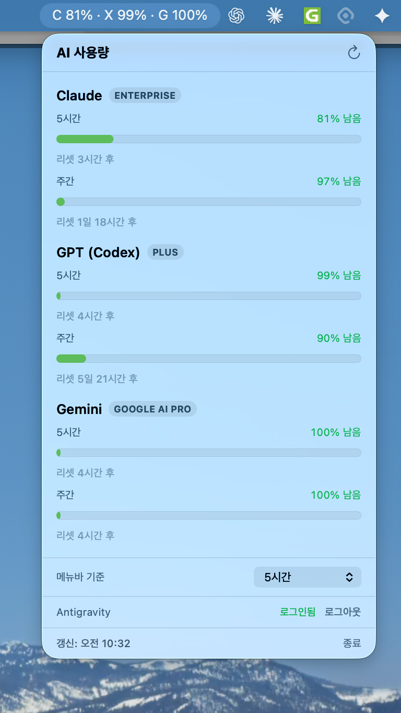

# TokenStatus — Release

Claude · GPT(Codex) · Gemini의 **잔여 사용량**을 macOS 메뉴바에 표시하는 앱의 배포 빌드.

  

## 다운로드

최신 빌드는 **[Releases](https://github.com/duhwan-lee/TokenStatus-Release/releases/latest)** 에서 받으세요 (Apple Silicon).

| 버전 | 파일 |
|---|---|
| 0.2.8 (최신, 공증) | [TokenStatus-0.2.8.dmg](https://github.com/duhwan-lee/TokenStatus-Release/releases/download/v0.2.8/TokenStatus-0.2.8.dmg) |
| 0.2.7 (공증) | [TokenStatus-0.2.7.dmg](https://github.com/duhwan-lee/TokenStatus-Release/releases/download/v0.2.7/TokenStatus-0.2.7.dmg) |
| 0.2.6 (공증) | [TokenStatus-0.2.6.dmg](https://github.com/duhwan-lee/TokenStatus-Release/releases/download/v0.2.6/TokenStatus-0.2.6.dmg) |
| 0.2.5 (공증) | [TokenStatus-0.2.5.dmg](https://github.com/duhwan-lee/TokenStatus-Release/releases/download/v0.2.5/TokenStatus-0.2.5.dmg) |
| 0.2.4 (공증) | [TokenStatus-0.2.4.dmg](https://github.com/duhwan-lee/TokenStatus-Release/releases/download/v0.2.4/TokenStatus-0.2.4.dmg) |
| 0.2.3 (공증) | [TokenStatus-0.2.3.dmg](https://github.com/duhwan-lee/TokenStatus-Release/releases/download/v0.2.3/TokenStatus-0.2.3.dmg) |
| 0.2.2 (공증) | [TokenStatus-0.2.2.dmg](https://github.com/duhwan-lee/TokenStatus-Release/releases/download/v0.2.2/TokenStatus-0.2.2.dmg) |
| 0.2.1 | [TokenStatus-0.2.1.dmg](https://github.com/duhwan-lee/TokenStatus-Release/releases/download/v0.2.1/TokenStatus-0.2.1.dmg) |
| 0.2.0 | [TokenStatus-0.2.0.dmg](https://github.com/duhwan-lee/TokenStatus-Release/releases/download/v0.2.0/TokenStatus-0.2.0.dmg) |
| 0.1.0 | [TokenStatus-0.1.0.dmg](https://github.com/duhwan-lee/TokenStatus-Release/releases/download/v0.1.0/TokenStatus-0.1.0.dmg) |

> DMG는 레포에 직접 두지 않고 Release asset으로만 관리합니다.

## 설치

1. 최신 DMG를 열고 `TokenStatus.app` 을 `Applications` 로 드래그.
2. **더블클릭으로 실행** — 0.2.2부터 Apple 공증(notarized)이 적용되어 별도 우회 없이 바로 열립니다.
3. 메뉴바 우측 상단에 사용량이 표시됩니다.

> 0.2.1 이하는 미공증이라 첫 실행 시 `xattr -dr com.apple.quarantine /Applications/TokenStatus.app` 우회가 필요합니다.

## 동작 전제 (각자 본인 계정 기준, 안 된 항목은 N/A)

- **Claude** : Claude Code 로그인 (첫 키체인 팝업에서 "항상 허용")
- **GPT** : Codex CLI(`codex`) 설치 + 로그인 (앱이 `codex app-server`로 라이브 조회)
- **Gemini** : 메뉴바 드롭다운에서 "Antigravity 로그인" 1회 (브라우저 동의). `agy` 설치 불필요 — 앱이 자체 로그인.

## 요구 사항

- macOS 14+ / Apple Silicon (arm64)
- 데이터는 각 제공자 공식 API로만 전송되며 제3자로 보내지 않습니다.
